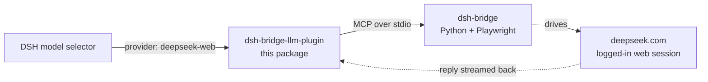

# dsh-bridge-llm-plugin

[](https://www.npmjs.com/package/dsh-bridge-llm-plugin)
[](LICENSE)
[](#requirements)
[](https://nodejs.org)

> **Use your logged-in DeepSeek web chat as a DeepSeek Harness model provider.**

This plugin registers an LLM provider (`deepseek-web`) that answers through your **real,
already-logged-in deepseek.com browser session** — driving the web UI via
[dsh-bridge](https://github.com/elysiamsia/dsh-bridge) instead of calling a paid API.

> ### ⚠️ Read this first — `deepseek-web` is **chat-only**
>
> The DeepSeek web UI exposes no structured tool-call output, so a model served this way
> **cannot call tools**. It is useful for conversation, drafting, and second opinions —
> **not** for agentic work that needs tools.

[中文说明](README.zh-CN.md) · [Sibling package](https://github.com/elysiamsia/dsh-bridge-plugin) · [Troubleshooting](#troubleshooting)



## Features

| | |
|---|---|
| 🆓 **No API billing** | Consumes your web-plan quota instead of API tokens |
| 🔐 **Your own session** | Uses the browser profile you are already signed in with |
| 🌊 **Streaming-shaped output** | The whole reply is emitted as `text-delta` chunks, so the UI streams |
| 🛡️ **Pre-flight rate-limit gate** | Refuses to send while the site is frozen, before touching the network |
| 🪶 **Zero dependencies** | Pure ESM JavaScript; implements the adapter contract without importing `dsh-llm` |
| 🔌 **Isolated fiber** | A failure here never affects your other plugins |

## Requirements

| Requirement | Notes |
|---|---|
| **DeepSeek Harness** | Desktop `0.2.0-rc.2` verified |
| **Node.js ≥ 20** | Provided by the DSH host |
| **dsh-bridge** | Python project, plus a completed `uv run dsh-login deepseek` |
| **Logged-in DeepSeek** | The browser profile dsh-bridge uses must hold a valid session |

## Install

### Option 1 — npm (simplest)

DSH → **Settings → Plugins → Add plugin**, paste:

```
dsh-bridge-llm-plugin
```

Or from a shell:

```sh
dsh plugin add dsh-bridge-llm-plugin
```

### Option 2 — local directory

```powershell
# installs BOTH dsh-bridge plugins (tools + LLM) with post-install verification:
powershell -ExecutionPolicy Bypass -File install-all-plugins.ps1
# uninstall:
powershell -ExecutionPolicy Bypass -File install-all-plugins.ps1 -Uninstall
```

### Option 3 — GitHub

```
https://github.com/elysiamsia/dsh-bridge-llm-plugin
```

> **Then fully quit and restart DSH Desktop.** Closing the window may only minimize it to
> the tray. After restarting, `deepseek-web` appears in the model selector.

## Configure

**This package ships no machine-specific paths.** Defaults assume `dsh-bridge` is on your
`PATH`. Running from a source checkout? Put **your** path in **your** profile
(`~/.dsh/profiles/<profile>/cordis.patch.yml`):

```yaml
# Replace with YOUR absolute path to the dsh-bridge checkout
- id: dsh-bridge-llm-plugin
  config:
    command: uv
    args: [run, --directory, /absolute/path/to/dsh-bridge, dsh-bridge]
    provider: deepseek-web
    modelId: deepseek-web
    toolCallTimeoutMs: 180000
```

To make it the **default** model, override the agent's model row too:

```yaml
- id: agent-default-model
  config:
    provider: deepseek-web
    model: deepseek-web
```

<details>
<summary><b>All configuration fields</b></summary>

| Field | Default | Purpose |
|---|---|---|
| `command` | `dsh-bridge` | Executable that starts the bridge |
| `args` | `[]` | Arguments passed to `command` |
| `cwd` | `""` | Working directory (inherited when empty) |
| `env` | `{}` | Extra environment variables |
| `provider` | `deepseek-web` | Provider route name (`[A-Za-z0-9_-]{1,32}`) |
| `modelId` | `deepseek-web` | Model id shown to the model selector |
| `displayName` | `DeepSeek (web chat login)` | Label in the selector |
| `toolCallTimeoutMs` | `180000` | Per-call timeout; each ask drives a browser |
| `bootstrapProbe` | `false` | Log a one-off adapter contract self-test at startup |

</details>

## Usage

Select **`deepseek-web`** in the model selector, then chat normally.

**Before your first real request**, renew the site session — a frozen site makes every
message fail with a rate-limit error:

```sh
uv run --no-sync dsh-login deepseek
```

<details>
<summary><b>Why was my request rejected with a rate-limit error?</b></summary>

This project enforces one hard rule: **every real-site smoke run revokes all four site
accounts at once.** The bridge's `ask` path does not check this itself, so the adapter runs
a **pre-flight gate** — reading the verify state through the bridge's pure-logic
`route_task` call (no browser, no network) and refusing when the site is frozen. If the
pre-flight check itself fails, it **fails closed**.

Fix: run `uv run --no-sync dsh-login deepseek`, then retry.

</details>

## Troubleshooting

### Switch on diagnostics

Logging is **off by default**:

```powershell
$env:DSH_BRIDGE_LLM_PLUGIN_DIAG = "$env:TEMP\dsh-bridge-llm-plugin.log"
```

It records module import, `apply` entry (including the real shape of `ctx`, e.g. whether
`ctx.llm.registerAdapter` exists), every step, and full exception stacks.

### The provider never appears

| Symptom | Check |
|---|---|
| No `deepseek-web` in the selector | DSH was not fully restarted, or the row failed to load |
| Plugin row shows *failed* | `DSH_BRIDGE_LLM_PLUGIN_DIAG` names the failing step |
| Provider listed, but every reply errors | The site is frozen — run `dsh-login deepseek` |

<details>
<summary><b>Implementation note: the adapter is duck-typed</b></summary>

`ctx.llm.registerAdapter()` performs **no `instanceof` check**, so this plugin does not
import `@deepseek-ai/dsh-llm` (which may not be resolvable from a profile). It implements
all seven base-class methods directly:

`providerInfo` · `providerRetryPolicy` · `imageRequestPricing` · `listModels` ·
`resolveModel` · `prepareCall` · `stream`

Missing any one would surface as a `TypeError` at call time.

</details>

## Development

```sh
node probe/verify-llm-plugin.mjs                 # self-check: stub-based, never touches a real site
node probe/check-npm-compat.mjs <package-name>   # will a third-party plugin be skipped?
```

| Script | Purpose |
|---|---|
| `probe/verify-llm-plugin.mjs` | Self-check: config, prompt building, adapter contract, rate-limit gate, stream |
| `probe/check-npm-compat.mjs` | Replays DSH's compatibility gate for any npm package before installing it |

## Releasing

Releases are automated by [`.github/workflows/publish.yml`](.github/workflows/publish.yml),
which publishes to npm when a `v*` tag is pushed:

```sh
npm version patch        # or minor / major — bumps package.json and creates the tag
git push --follow-tags   # the tag triggers the workflow
```

The workflow verifies that the tag matches `package.json`, runs the offline self-check,
then publishes with provenance. It needs a repository secret named `NPM_TOKEN` — a
**granular access token with "Bypass 2FA" enabled** (this npm account uses 2FA; a plain
token is rejected in CI with `E403`). You can also trigger it manually from the Actions
tab, where the default is a `--dry-run`.

## Contributing

Issues and PRs are welcome. Keep the zero-dependency, no-build-step constraint, and please
run the self-check before opening a PR.

## License

[MIT](LICENSE)

## Acknowledgements

- [dsh-bridge](https://github.com/elysiamsia/dsh-bridge) — the Python browser bridge behind every call
- [DeepSeek Harness](https://github.com/deepseek-ai/deepseek-harness) — the host and its LLM adapter contract
