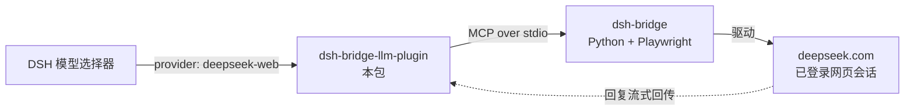

# dsh-bridge-llm-plugin

[](https://www.npmjs.com/package/dsh-bridge-llm-plugin)
[](LICENSE)

> **把你已登录的 DeepSeek 网页会话，注册成 DeepSeek Harness 的模型 provider。**

本插件注册一个 LLM provider（`deepseek-web`）：它通过你**真实、已登录的 deepseek.com
浏览器会话**回答 —— 由 [dsh-bridge](https://github.com/elysiamsia/dsh-bridge) 驱动网页 UI，
而不是调用付费 API。

> ### ⚠️ 先读这条 —— `deepseek-web` **只能纯对话**
>
> DeepSeek 网页 UI 不提供结构化的工具调用输出，所以经它提供的模型**无法调用任何工具**。
> 它适合对话、起草、要第二意见 —— **不适合**需要工具能力的 Agent 工作。

[English](README.md) · [姊妹包](https://github.com/elysiamsia/dsh-bridge-plugin) · [排障](#排障)



## 特性

| | |
|---|---|
| 🆓 **不花 API 钱** | 消耗网页版额度，而不是 API token |
| 🔐 **用你自己的会话** | 复用你已登录的浏览器 profile |
| 🌊 **类流式输出** | 整段回复切成 `text-delta` 分块吐出，UI 有流式观感 |
| 🛡️ **前置频控闸门** | 站点冻结时**在触网之前**拒绝发送 |
| 🪶 **零依赖** | 纯 ESM JavaScript；不 import `dsh-llm` 也实现了 adapter 契约 |
| 🔌 **fiber 隔离** | 它出问题不会影响你其他插件 |

## 前置条件

| 条件 | 说明 |
|---|---|
| **DeepSeek Harness** | 桌面版 `0.2.0-rc.2` 实测通过 |
| **Node.js ≥ 20** | DSH 宿主自带 |
| **dsh-bridge** | Python 项目，且已跑过 `uv run dsh-login deepseek` |
| **DeepSeek 登录态** | dsh-bridge 使用的浏览器 profile 必须有有效会话 |

## 安装

### 方式 1 — npm（最简单）

DSH → **设置 → 插件 → 添加插件**，粘贴：

```
dsh-bridge-llm-plugin
```

或命令行：

```sh
dsh plugin add dsh-bridge-llm-plugin
```

### 方式 2 — 本地目录

```powershell
# 一次装两个 dsh-bridge 插件（工具 + LLM），并做安装后校验：
powershell -ExecutionPolicy Bypass -File install-all-plugins.ps1
# 卸载：
powershell -ExecutionPolicy Bypass -File install-all-plugins.ps1 -Uninstall
```

### 方式 3 — GitHub

```
https://github.com/elysiamsia/dsh-bridge-llm-plugin
```

> **装完要完全退出并重启 DSH Desktop**（关窗口可能只是最小化到托盘）。重启后
> 模型选择器里会出现 `deepseek-web`。

## 配置

**本包不含机器专属路径**，默认假定 `dsh-bridge` 已在 `PATH` 上。若你从源码目录跑，
请把**你的**路径写进**你的** profile（`~/.dsh/profiles/<profile>/cordis.patch.yml`）：

```yaml
# 换成你自己机器上 dsh-bridge 检出目录的绝对路径
- id: dsh-bridge-llm-plugin
  config:
    command: uv
    args: [run, --directory, /absolute/path/to/dsh-bridge, dsh-bridge]
    provider: deepseek-web
    modelId: deepseek-web
    toolCallTimeoutMs: 180000
```

想把它设为**默认模型**，再覆盖 agent 的模型行：

```yaml
- id: agent-default-model
  config:
    provider: deepseek-web
    model: deepseek-web
```

<details>
<summary><b>全部配置字段</b></summary>

| 字段 | 默认 | 作用 |
|---|---|---|
| `command` | `dsh-bridge` | 启动桥接的可执行文件 |
| `args` | `[]` | 传给 `command` 的参数 |
| `cwd` | `""` | 工作目录（空则继承） |
| `env` | `{}` | 追加环境变量 |
| `provider` | `deepseek-web` | provider 路由名（`[A-Za-z0-9_-]{1,32}`） |
| `modelId` | `deepseek-web` | 模型选择器里的模型 id |
| `displayName` | `DeepSeek (web chat login)` | 选择器里的显示名 |
| `toolCallTimeoutMs` | `180000` | 单次调用超时；每次 ask 都要驱动浏览器 |
| `bootstrapProbe` | `false` | 启动时记录一次 adapter 契约自检 |

</details>

## 使用

在模型选择器里选 **`deepseek-web`**，然后正常对话。

**第一次真实请求前**先续期站点会话 —— 冻结状态下每条消息都会报频控错：

```sh
uv run --no-sync dsh-login deepseek
```

<details>
<summary><b>为什么我的请求被频控拒了？</b></summary>

本项目围绕一条硬规则：**每跑 1 次真站冒烟 = 4 个站点账号同时吊销。**
桥接的 `ask` 路径本身不检查这一点，所以 adapter 加了一道**前置闸门** ——
用桥接里纯逻辑的 `route_task`（不起浏览器、不触网）读一次 verify 状态，
站点冻结就拒绝。**若前置检查本身失败，选择"保守拒绝"。**

解法：跑 `uv run --no-sync dsh-login deepseek`，然后重试。

</details>

## 排障

### 打开诊断日志

日志**默认关闭**：

```powershell
$env:DSH_BRIDGE_LLM_PLUGIN_DIAG = "$env:TEMP\dsh-bridge-llm-plugin.log"
```

它会记录模块导入、`apply` 入口（含 `ctx` 的真实形状，例如 `ctx.llm.registerAdapter`
是否存在）、每一步、以及完整异常栈。

### provider 一直不出现

| 现象 | 检查 |
|---|---|
| 选择器里没有 `deepseek-web` | DSH 没有**完全**重启，或该行加载失败 |
| 插件行显示「异常」 | 打开 `DSH_BRIDGE_LLM_PLUGIN_DIAG`，日志会指出失败在哪一步 |
| provider 在，但每次回复都报错 | 站点冻结了 —— 跑 `dsh-login deepseek` |

<details>
<summary><b>实现说明：adapter 是鸭子类型</b></summary>

`ctx.llm.registerAdapter()` **不做 `instanceof` 检查**，所以本插件**不** import
`@deepseek-ai/dsh-llm`（该包在 profile 里可能解析不到）。它直接实现基类全部 7 个方法：

`providerInfo` · `providerRetryPolicy` · `imageRequestPricing` · `listModels` ·
`resolveModel` · `prepareCall` · `stream`

**缺任何一个**都会在调用时变成 `TypeError`。

</details>

## 开发

```sh
node probe/verify-llm-plugin.mjs                 # 自检：全用 stub，绝不碰真站
node probe/check-npm-compat.mjs <包名>            # 装第三方插件前先判它会不会被跳过
```

| 脚本 | 用途 |
|---|---|
| `probe/verify-llm-plugin.mjs` | 自检：配置、提示词拼装、adapter 契约、频控闸门、stream |
| `probe/check-npm-compat.mjs` | 复现 DSH 的兼容性闸门，装任何 npm 包前预判是否会被 skip |

## 发版

发版由 [`.github/workflows/publish.yml`](.github/workflows/publish.yml) 自动化：推送 `v*` tag 即发布到 npm。

```sh
npm version patch        # 或 minor / major —— 会改 package.json 并创建 tag
git push --follow-tags   # tag 触发 workflow
```

workflow 会校验 tag 与 `package.json` 一致、跑一遍离线自检，然后带 provenance 发布。
它需要仓库密钥 `NPM_TOKEN` —— 一个**勾选了「Bypass 2FA」的 Granular Access Token**
（本 npm 账号开了 2FA；普通 token 会在 CI 里被拒 `E403`）。也可以在 Actions 页面手动触发，
默认是 `--dry-run`。

## 贡献

欢迎提 Issue 与 PR。请保持**零依赖、无构建步骤**的约束，并在开 PR 前跑一次自检。

## 许可

[MIT](LICENSE)

## 致谢

- [dsh-bridge](https://github.com/elysiamsia/dsh-bridge) —— 每次调用背后的 Python 浏览器桥接
- [DeepSeek Harness](https://github.com/deepseek-ai/deepseek-harness) —— 宿主及其 LLM adapter 契约
